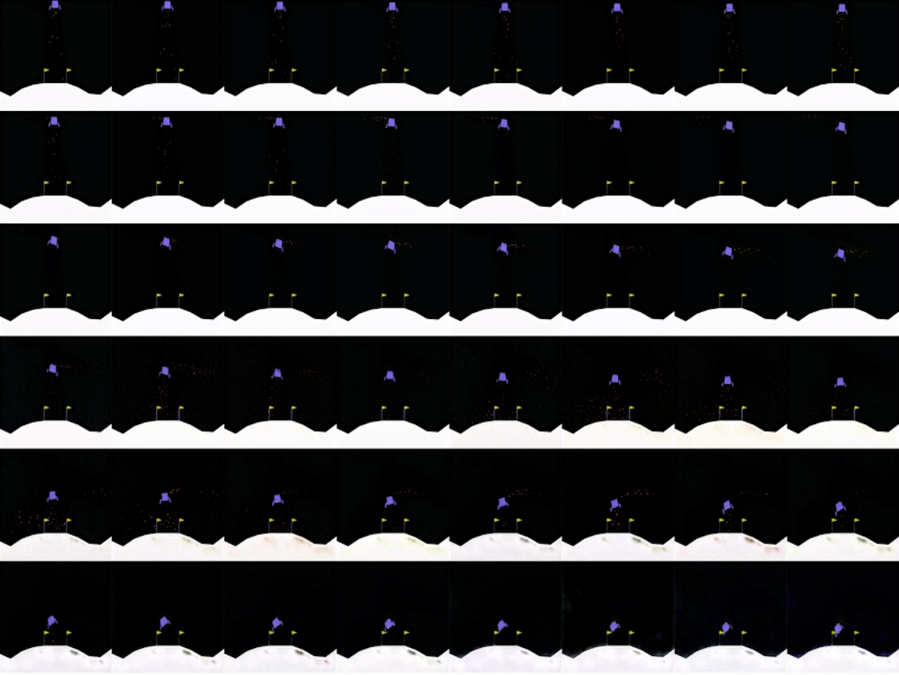
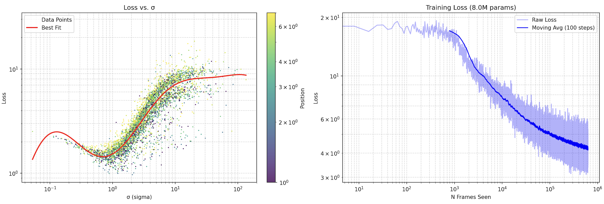

# Oniris: Autoregressive and Sample-Efficient Next-Gen Video Diffusion
> [!WARNING]
> This repository is still in development. For now there are no instructions on how to run the code because it is subject to change

Oniris is an universal and novel way of training diffusion models for video generation and world-modelling-- It generalizes and improves upon all of the previously known methods of video diffusion models and diffusion-based world-modelling

- Each frame is generated sequencially and can attent to all of its context frames (just like LLMs generate tokens)
- The training is sample-efficient. (just like LLM training)
- Each frame is generated via a reverse-diffusion process. (just like diffusion for image generation)
- The architecture is a generalization of what can be found on the paper ["Analyzing and Improving the Training Dynamics of Diffusion Models"](https://arxiv.org/abs/2312.02696)

## Early Results
> [!IMPORTANT]
> Working on training it on Counter-Strike. Stay tuned, for now here are the results with the lunar lander

This are the results of a ~4 hours training run with a Nvidia RTX 4090. The model was trained on the Lunar-Lander gymnasium environment. 

    

In the image above the first three rows are given as context, the next 3 rows are generated by Oniris.

## Comparison with other types of models
To this day 3 main techniques have been used to generate a sequence of frames (image taken from [the DIAMOND paper](https://arxiv.org/pdf/2405.12399))

All of them have deal-breaking problems:

1. *__The Diffusion for video generation__* can only effectively generate videos of fixed time duration, and it's of no use for world-modelling.

2. *__The Frame-stacking architecture__* can't attend in an effective way to previous frames, so it suffers from severe amnesia.

3. *__The Cross-attention architecture__* is the one that makes most sense. However, it's extremely inefficient during training because cost per sample increases (super-)linearly with the number of context frames. 

### Oniris has ALL OF THE STRENGHTS and NONE OF THE WEAKNESSNES of all of the above.
1. It is sample-efficient like diffusion video generation. __On top of that__ it can generate videos of any length and can be used for world-modelling. (In the future this model can be expanded to be able to generate multiple frames at the same time)

2. It implicitly employs frame-stacking because it uses 3D convolutional layers-- They can be thought as stacking frames channel-wise and then doing 2D convolutions. __On top of that__ it doesn't suffer from amnesia because it can attend all of the previous frames with the attention mechanism.

3. It can attend to all of the previous frames. __On top of that__ during training the computational cost per-sample is (roughly) constant as the context lenght increases.

# How it works
> [!WARNING]
> The information provided below is just a brief overview of what's going on under the hood.

## Inference

One way to train a Diffusion model is to learn to predict the score function

$$ s(x,\sigma) = -\nabla_x \log p(x,\sigma)$$

The most used architectures are UNets and Image-Transformers.

Language models work by estimating the probablilty distribuition of the last token given all of the previous ones

$$F(x_i,\dots,x_0)=-\log p(x_{i+1}|x_i,\dots,x_0)$$

The transformer architecture allows to train such a model in a sample-efficient way. This is very important because it multiplies the effictive batch size by the sequence lenght.

To generate a video where each frame if generated autoregressively we need to unite the two paradigms by estimating the score given all of the previous frames.

Last-frame generation can be thought as image generation conditioned on the previous frames.

$$s(x_i,\sigma,x_{i-1},\dots,x_0)=-\nabla_{x_i} \log p(x_i,\sigma|x_{i-1},\dots,x_0) $$

Where $x_{i-1},\dots,x_0$ are the noise-free context frames, $x_i$ is the noisy (to be denoised) frame, and $\sigma$ is the noise level

## Training
Here is how you make the training in a way that is sample-efficient.

Let $(x_1,\dots,x_n)$ be a sequence of frames from the training set.
To train the model in a way that is sample-efficient we create two copies of the input sequence:
- The first part is not noised $x_c=(x_1,\dots,x_n)$
- The second part is noised $x_\epsilon=(\tilde x_1,\dots,\tilde x_n)$ where each frame is noised as $\tilde x_{\epsilon,i} = x_i +\sigma_i\epsilon$.

The input sequence $x$ is formed by concatenating the two sequences

$$
x = x_c \oplus x_\epsilon = (x_1,\dots,x_n,\tilde x_1,\dots,\tilde x_n)
$$

Here is an animation that shows how the training and inference logic are connected

https://github.com/user-attachments/assets/b54d7a44-a31f-4984-a34e-033758fb1eb0

In this model there are two modules that can transfer information between frames
- `VideoAttention`
- `3DCausalConvolution`

# Modules
### Video Attention Module (Inference)
During inference the attention module implements causal attention masking in a manner similar to how it's done in autoregressive language modelling

    

The only difference is that the mask is block-sparse

>During inference the model uses KV-caching to make it fast.

### Video Attention Module (Training)
Here is an illustrative image that shows how the information moves

    

> Here is a schematic representation on how the inputs and output interact. TODO: make this better!

This can be archieved by doing block-sparse masking using [FlexAttention](https://pytorch.org/blog/flexattention/). Thanks to it no computation is wasted.

    

### 3D Causal Convolution 
Wierdly enough, the convolution layer is the hardest to explain because it relies on a couple of tricks to make sure that the code runs as fast and efficiently as possible during training.

I'll write later how it works exactly. [For now you can read the code](edm2/conv.py)

During inference the model caches only the activations inside of convolutional filter. This leads to yet another big improvement in speed making the per-frame inference computation ~O(1).

## Loss
The loss is computed indipendently for each frame. The equations are adapted from [[1](https://arxiv.org/pdf/2206.00364),[2](https://arxiv.org/abs/2312.02696)]

Here are the (slightly oversiplified) equations. Let $D_\theta$ be the trainable model, $x_c$ the clean images and $x$ the images fed into the model (see Training section).

$$
\mathcal L(x,\sigma) = \lambda(\sigma)\cdot\mathbb E_{x_c}||D_\theta (x,\sigma)-x_c||^2
$$

where 

$$
\lambda(\sigma) = (\sigma^2 +\sigma_\textrm{data}^2)/(\sigma\cdot \sigma_\textrm{data})
$$

And this is what you see in the graph below

    

> In the image above on the left how the average loss goes down as the training progresses (~12h of a RTX4090). On the right it is shown the relashionship between the loss, the noise applied and the position along the sequence.

However the losses are normalized by their expected value with respect to $\sigma$ before being averaged inside of the batch.

$$
L(x,\sigma)=\frac {\mathcal L(x,\sigma)}{\mathbb E_x[\mathcal L(x,\sigma)]}
$$

This ensures that the loss $L$ that is passed to the autograd engine has always an average of one for every $\sigma$. The expectation value is computed with a best fit (see image above on the right)

# The Variational Auto-Encoder
We also developed a Group-Causal VAE that is capable of compressing arbitrarly long sequences very cheaply without compromising on performance with just one consumer gpu. We didn't want to do it in house, but we had because we didn't find anything like this.

The architecture is similar to a ResNet, but instead of using standard 2D convolutions we used Group-Causal 3D-Convolutional layers inspired from [Improved Video VAE for Latent Video Diffusion Model](https://www.alphaxiv.org/html/2411.06449v1) but we simplified, streamlined and generalized their implementation. 

    

We did not use any form of attention in the VAE.
- Temporal attention makes it impossible to encode arbitrarly long sequences as the RAM usage increases linearly with the context size. 
- Spatial attention does not improve significantly the performance of VAEs. Most of the information moves locally.

We also added a group-wise KL-divergence loss (following [How to train your VAE](https://arxiv.org/abs/2309.13160) paper)

Below you can see the results for the training of the VAE

    

