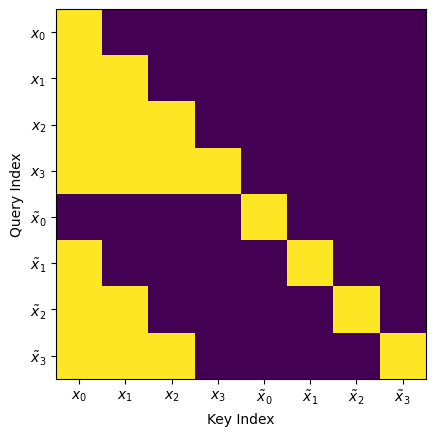

# Sample Efficient Autoregressive Diffusion

This repository shows a novel way for training diffusion models for video generation and world-modelling.

- The frames are generated sequencially given the previous known frames (just like LLMs generate tokens)
- The training is sample efficient. (just like LLM training)
- Each frame is generated via a reverse diffusion process.
- The architecture, the training and the reverse-diffusion process is a generalization of what can be found on the paper ["Analyzing and Improving the Training Dynamics of Diffusion Models"](https://arxiv.org/abs/2312.02696)

## Comparison with other types of models
To this day 3 main tecniques have been used to generate a sequence of frames (image taken from [the DIAMOND paper](https://arxiv.org/pdf/2405.12399))

All of them have deal-breaking problems:

1. *__The Diffusion for video generation__* can only effectively generate video of fixed time duration, and it's of no use for world-modelling.

2. *__The Frame-stacking architecture__* can't attend in an effective way to previous frames, so it suffers from severe amnesia.

3. *__The Cross-attention architecture__* is the one that makes most sense. However, it's extremely inefficient during training because cost per sample increases linearly with the number of context frames. 

### This model has all of the strenghs and none of the weakness of all of the above.
1. It is sample efficient like diffusion video generation. __On top of that__ it can be used for world-modelling.

2. It implicitly employs Frame-stacking because it uses 3D convolutional layers-- They can be thought as stacking frames channel-wise and then doing 2D convoluions. __On top of that__ it doesn't suffer from amnesia because it can attend all of the previous frames with the attention mechanism.

3. It can attend to all of the previous frames. __On top of that__ It $N$ times more efficient during training (where $N$ is the number of frames in the context) because it is sample efficient.

# How it works
Here I give a very brief explanation on how it works, in the future I hope to write a paper that goes into detail.

## Inference

One way to train a Diffusion model is to learn to predict the score function

$$ s(x,\sigma) = -\nabla_x \log p(x,\sigma)$$

The most used architectures are UNets and Image-Transformers.

---
Language models work by estimating the probablilty distribuition of the last token given all of the previous ones

$$F(x_i,\dots,x_0)=-\log p(x_{i+1}|x_i,\dots,x_0)$$

The transformer architecture allows to train such a model in a sample efficient way. This is very important because it multiplies the effictive batch size by the sequence lenght.

---
To generate a video where each frame if generated autoregressively we need to unite the two paradigms by estimating the score given all of the previous frames.

$$s(x_{i+1},\sigma,x_i,\dots,x_0)=-\nabla_x \log p(x_{i+1},\sigma|x_i,\dots,x_0) $$

Where $x_i,\dots,x_0$ are the noise-free context frames, $x_{i+1}$ is the noisy (to be denoised) frame, and $\sigma$ is the noise level

## Training
Here is how you make the training in a way that is sample efficient.

Let $(x_1,\dots,x_n)$ be a sequence of frames from the training set.
To train the model in a way that is sample efficient we create two copies of the input sequence:
- The first part is not noised $x_c=(x_1,\dots,x_n)$
- The second part is noised $x_n=(\tilde x_1,\dots,\tilde x_n)$ where each frame is noised as $\tilde x_i = x_i +\sigma_i\epsilon$.

The input sequence $x$ is formed by concatenating the two sequences

$$
x = x_c \oplus x_n = (x_1,\dots,x_n,\tilde x_1,\dots,\tilde x_n)
$$

<!-- To maintain causality we have to make sure that the $i$-th output of the network $N(x)_i$ is only dependent from the noised frame $\tilde x_i$ and all of the previous frames $\{x_j\}_{j<i}$

$$
N(x)_i=f(\tilde x_i,  \{x_j\}_{j<i},\sigma_i)
$$ -->

In this model there are two modules that can transfer information between frames
- `VideoAttention`
- `3DCausalConvolution`

Here is how you make sure that each one of them is really efficient and preserves causality. 

### Video Attention module
Here is an illustrative image that shows how the information moves

This can be archieved by doing block-sparse masking using [FlexAttention](https://pytorch.org/blog/flexattention/). Thanks to it no computation is wasted.

### 3D Causal Convolution
Wierdly enough, the convolution layer is the hardest to explain because it relies on a couple of tricks to make sure that the code runs as fast as possible during training.

I'll write later how it works exactly. For now you can read the code

